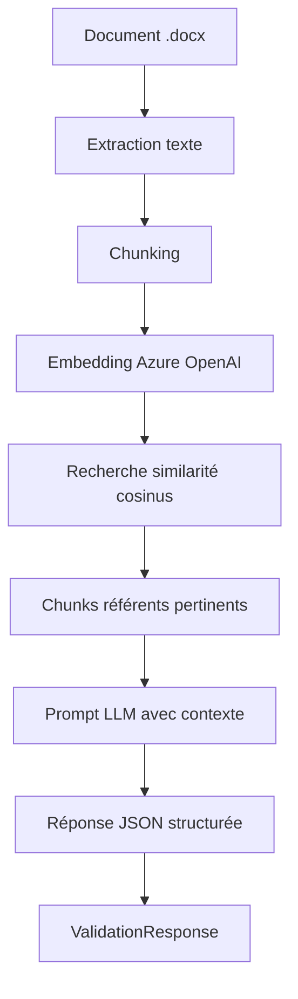

# Leon Spec Validator

API de validation intelligente de spécifications composant/pièce par **RAG** (Retrieval-Augmented Generation) avec **Azure OpenAI**.

## Architecture

```
leon-spec-validator/
├── app/
│   ├── main.py          ← API FastAPI (endpoints /ingest, /validate, /status)
│   ├── ingest_refs.py   ← Pipeline ingestion docs → chunks → embeddings → index
│   ├── chunking.py      ← Stratégies de découpage (paragraphes / sections)
│   ├── embeddings.py    ← Client Azure OpenAI (embeddings + LLM + cosine similarity)
│   ├── config.py        ← Configuration centralisée (.env)
│   └── models.py        ← Modèles Pydantic (requêtes/réponses API)
├── data/
│   ├── refs/            ← Documents de référence (.docx)
│   └── uploads/         ← Uploads temporaires
├── tests/
│   ├── conftest.py      ← Fixtures partagées
│   ├── test_chunking.py ← Tests unitaires chunking
│   ├── test_embeddings.py ← Tests similarité/recherche
│   ├── test_ingest_refs.py ← Tests pipeline ingestion
│   └── test_main.py     ← Tests intégration API
├── .env                 ← Variables d'environnement (Azure OpenAI)
├── requirements.txt     ← Dépendances Python
└── README.md
```

## Prérequis

- Python 3.11+
- Azure OpenAI (endpoint + API key + déploiements)
- Documents de référence en `.docx` dans `data/refs/`

## Installation

```bash
# 1. Environnement virtuel
python -m venv .venv
.venv\Scripts\activate  # Windows
# source .venv/bin/activate  # macOS/Linux

# 2. Dépendances
pip install -r requirements.txt

# 3. Configurer .env (éditer avec vos valeurs)
# AZURE_OPENAI_ENDPOINT=...
# AZURE_OPENAI_API_KEY=...
# AZURE_OPENAI_LLM_DEPLOYMENT=gpt-4o
# AZURE_OPENAI_EMBEDDING_DEPLOYMENT=text-embedding-3-large
```

## Utilisation

### 1. Lancer l'API

```bash
uvicorn app.main:app --reload --port 8000
```

### 2. Ingérer les documents de référence

```bash
# Via l'API
curl -X POST http://localhost:8000/ingest

# Ou en ligne de commande
python -m app.ingest_refs
```

### 3. Valider une spécification

```bash
# Via texte brut
curl -X POST http://localhost:8000/validate \
  -F "text=Spécification du composant X. Doit résister à 500°C."

# Via upload de fichier .docx
curl -X POST http://localhost:8000/validate \
  -F "file=@ma_spec.docx"
```

### 4. Vérifier le statut

```bash
curl http://localhost:8000/status
```

## Endpoints API

| Méthode | Chemin      | Description                              |
|---------|-------------|------------------------------------------|
| GET     | `/`         | Health check + statut index              |
| GET     | `/status`   | Statut détaillé de l'index              |
| POST    | `/ingest`   | (Re)construire l'index vectoriel        |
| POST    | `/validate` | Valider une spécification (texte/fichier) |

## Exécution des tests

```bash
pytest tests/ -v
```

## Flux de validation



## Licence

Interne — Projet PCM_AI
