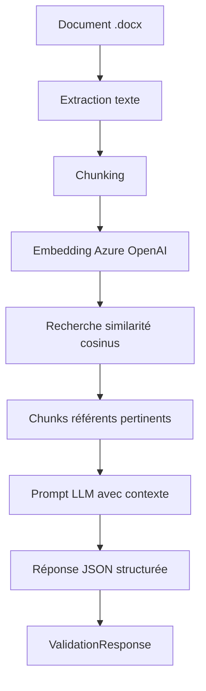

# Leon Spec Validator

API de validation intelligente de spécifications composant/pièce par **RAG** (Retrieval-Augmented Generation) avec **Azure OpenAI**.

## Architecture

```
leon-spec-validator/
├── app/
│   ├── main.py          ← API FastAPI (endpoints /ingest, /validate, /status)
│   ├── ingest_refs.py   ← Pipeline ingestion docs → chunks → embeddings → index
│   ├── chunking.py      ← Stratégies de découpage (paragraphes / sections)
│   ├── embeddings.py    ← Client Azure OpenAI (embeddings + LLM + cosine similarity)
│   ├── config.py        ← Configuration centralisée (.env)
│   └── models.py        ← Modèles Pydantic (requêtes/réponses API)
├── data/
│   ├── refs/            ← Documents de référence (.docx)
│   └── uploads/         ← Uploads temporaires
├── tests/
│   ├── conftest.py      ← Fixtures partagées
│   ├── test_chunking.py ← Tests unitaires chunking
│   ├── test_embeddings.py ← Tests similarité/recherche
│   ├── test_ingest_refs.py ← Tests pipeline ingestion
│   └── test_main.py     ← Tests intégration API
├── .env                 ← Variables d'environnement (Azure OpenAI)
├── requirements.txt     ← Dépendances Python
└── README.md
```

## Prérequis

- Python 3.11+
- Azure OpenAI (endpoint + API key + déploiements)
- Documents de référence en `.docx` dans `data/refs/`

## Installation

```bash
# 1. Environnement virtuel
python -m venv .venv
.venv\Scripts\activate  # Windows
# source .venv/bin/activate  # macOS/Linux

# 2. Dépendances
pip install -r requirements.txt

# 3. Configurer .env (éditer avec vos valeurs)
# AZURE_OPENAI_ENDPOINT=...
# AZURE_OPENAI_API_KEY=...
# AZURE_OPENAI_LLM_DEPLOYMENT=gpt-4o
# AZURE_OPENAI_EMBEDDING_DEPLOYMENT=text-embedding-3-large
```

## Utilisation

### Interface AERIS

L'interface porte le nom **AERIS (Automated Engineering Review & Integrity System)**.
Elle conserve les traitements et endpoints existants : analyse des matrices de
conformité, validation des spécifications, revue matrice/TDR avec décisions
humaines, liaison des preuves, benchmark technique multi-fournisseurs,
comparaison des versions et exports.
La navigation, les indications de prise en main et la présentation sont adaptées
aux écrans mobiles et à la navigation au clavier.
Les statuts OK/NOK affichés pour les matrices sont ceux déclarés par le
fournisseur, pas une certification indépendante. Les filtres exposent leur
sélection aux lecteurs d'écran ; les détails techniques de lecture du fichier
restent consultables dans une section dépliable. Les indications sous les
boutons précisent la prochaine action et les recherches sans résultat proposent
de modifier les critères.

Pour ouvrir l'interface complète en local :

```powershell
python -m uvicorn app.conformity_server:app --host 127.0.0.1 --port 8012
```

Ouvrir `http://127.0.0.1:8012`. L'assistant de spécifications conserve son point
d'entrée séparé : `python -m app.qa_server`, puis `http://127.0.0.1:8010`.

Ces adresses sont locales, pas des liens publics. Ne pas exposer le serveur
interne sans contrôle d'accès : il utilise des références et documents internes.
Un accès public sans connexion nécessite un hébergement approuvé et une isolation
des données, des uploads et des secrets.

#### Revue des commentaires de matrice

La revue approfondie examine les commentaires des réponses **déclarées OK** :
conflit statut/commentaire, conformité conditionnelle, vérification en attente
et commentaire potentiellement hors sujet. Une action ouverte ou une preuve
manquante n'est pas une preuve de non-conformité. Les autres statuts restent
consultables ; cette revue ne certifie pas la conformité et ne compare pas les
preuves d'un TDR.

Les constats contiennent la description de l'exigence, la ligne source, une
citation du commentaire et une action de clarification ou de vérification.
Les citations IA doivent être présentes dans le texte envoyé au modèle ; les
réponses invalides, dupliquées ou incomplètes passent aux contrôles par motifs,
avec journalisation. Les confirmations simples et réponses sans commentaire
sont comptabilisées séparément, sans créer artificiellement des anomalies.
L'interface, le rapport PDF et les rapports Excel indiquent la couverture réelle
de revue. Aucun signal détecté ne signifie pas « toutes les exigences validées ».

Le modèle Azure existant est utilisé lorsqu'il est configuré. Au maximum 150
commentaires substantiels sont envoyés par analyse, par lots de 25, avec 2 000
caractères de commentaire et 1 200 caractères de description par ligne. Les
limites et recours aux motifs sont signalés. Les exports Excel conservent leurs
colonnes d'analyse et ajoutent une feuille **Review Coverage**.
Les synthèses affichent également les déviations et les réponses vides ; le
rapport PDF détaille les cinq catégories, et le jeu de données Power BI conserve
des colonnes cohérentes avec les lignes exportées.

Les modèles DIA utilisent la **Supplier Concurrence** comme réponse fournisseur,
la **Stellantis Policy & Procedure** comme exigence, et réunissent la justification
de méthode alternative avec **Supplier Assumptions and Comments**. Les commentaires
client, les rôles RASI, le type de livraison et le statut d'accord global ne sont
pas des commentaires fournisseur. Les valeurs exactes de contrôle non sélectionné
(par exemple `<select>`) ne constituent ni une réponse ni une preuve. Une cellule
d'exigence explicitement identifiée mais vide n'est pas remplacée par un livrable.
La lecture conserve la sélection d'une seule feuille de matrice ; elle ne fusionne
pas automatiquement les différentes versions DIA présentes dans le classeur.

Le graphique SVG de secours affiche un cercle complet lorsqu'une seule catégorie
contient toutes les réponses représentées (par exemple 100 % OK). Les réponses
vides sont exclues du graphique s'il existe des réponses renseignées ; le total
du graphique peut donc être inférieur au nombre total d'exigences. Les réponses
vides restent visibles dans les statistiques et dans le tableau.

Les constats dans l'interface séparent l'explication, la citation fournisseur et
l'action suivante ; le texte complet de l'exigence reste dépliable. Les contrôles
par motifs restent moins complets qu'une revue sémantique, notamment pour les
comparaisons numériques et les unités. Les cas synthétiques de
`tests/test_conformity_precision.py` permettent de mesurer séparément précision,
rappel, citations et actions ; ils ne constituent pas une certification ni une
estimation de précision sur tous les documents fournisseurs.

Pour un essai local sans appel Azure (contrôles par motifs uniquement), définir
`AZURE_OPENAI_API_KEY` et `AZURE_OPENAI_ENDPOINT` à une chaîne vide dans le
processus Python avant d'importer l'application. Ne pas modifier le fichier
`.env` pour désactiver temporairement ces appels. Utiliser des matrices
synthétiques pour tester le modèle et ne transmettre aucun document confidentiel
à un service non approuvé.

L'interface Azure existante est accessible à
`https://leon-spec-gbexcnefdmakfpdg.francecentral-01.azurewebsites.net/api/conformity-ui`.
Elle propose les deux traitements anonymes déjà déployés : analyse des matrices et
validation des spécifications. La comparaison des versions reste disponible en
local ; son endpoint d'upload n'existe pas dans cette version Azure.
La nouvelle interface locale conserve les six rubriques d'origine. Les rubriques
dont le service n'est pas disponible restent visibles avec un avertissement,
sans implémentation de remplacement ni modification du backend. La liaison
PDF/PowerPoint des preuves reste indisponible tant que ses endpoints ne sont pas
enregistrés par le serveur courant ; la revue matrice/TDR et le benchmark
utilisent leurs scripts et services existants. Le lien Azure garde la version
publiée précédemment jusqu'à une publication explicitement approuvée.
Utiliser uniquement des documents de test non
confidentiels pour les essais publics. L'assistant Q&A et les autres endpoints
conservent leurs règles d'accès existantes.

La publication AERIS remplace uniquement l'interface dans une copie du package
Azure actif, sans modifier les autres fichiers, les réglages d'accès ou le backend.
Elle ne nécessite aucun push Git.

### 1. Lancer l'API

```bash
uvicorn app.main:app --reload --port 8000
```

### 2. Ingérer les documents de référence

```bash
# Via l'API
curl -X POST http://localhost:8000/ingest

# Ou en ligne de commande
python -m app.ingest_refs
```

### 3. Valider une spécification

```bash
# Via texte brut
curl -X POST http://localhost:8000/validate \
  -F "text=Spécification du composant X. Doit résister à 500°C."

# Via upload de fichier .docx
curl -X POST http://localhost:8000/validate \
  -F "file=@ma_spec.docx"
```

### 4. Vérifier le statut

```bash
curl http://localhost:8000/status
```

## Endpoints API

| Méthode | Chemin      | Description                              |
|---------|-------------|------------------------------------------|
| GET     | `/`         | Health check + statut index              |
| GET     | `/status`   | Statut détaillé de l'index              |
| POST    | `/ingest`   | (Re)construire l'index vectoriel        |
| POST    | `/validate` | Valider une spécification (texte/fichier) |

## Exécution des tests

```bash
pytest tests/ -v
```

## Flux de validation


```mermaid
flowchart TD
    A[Document .docx] --> B[Extraction texte]
    B --> C[Chunking]
    C --> D[Embedding Azure OpenAI]
    D --> E[Recherche similarité cosinus]
    E --> F[Chunks référents pertinents]
    F --> G[Prompt LLM avec contexte]
    G --> H[Réponse JSON structurée]
    H --> I[ValidationResponse]
```

## Licence

Interne — Projet PCM_AI
