# Spec Q&A Assistant

A minimal web-based Q&A assistant that answers questions **only** from accessible
engineering specification files. It never uses BeStandard or standards repositories,
never invents details, and clearly says when support is not found.

## Architecture (modular)

```
app/
├── qa/
│   ├── __init__.py
│   ├── retrieval.py   # file indexing + chunking + keyword/semantic retrieval
│   ├── prompt.py       # strict prompt template (answer only from retrieved content)
│   ├── mock_data.py    # example mock data so the UI runs before real retrieval
│   └── route.py        # FastAPI router: POST /api/ask, GET /api/files
├── qa_ui/
│   └── index.html      # React chat UI (CDN, no build step)
└── qa_server.py        # standalone FastAPI app serving UI + API
```

Separation of concerns:
- **UI** — `app/qa_ui/index.html` (React chat interface)
- **API route** — `app/qa/route.py`
- **Retrieval logic** — `app/qa/retrieval.py`
- **Prompt logic** — `app/qa/prompt.py`

## Output contract

```json
{
  "answer": "string",
  "sources": [{ "fileName": "string", "excerpt": "string" }]
}
```

## Guardrails

- Never answers from general model knowledge if retrieval has no support.
- Never claims standard compliance without an accessible source.
- Never hides uncertainty — prefers "not found" over guessing.
- Sources are always visible in the UI.
- Questions about standards / BeStandard get a fixed refusal message.

## Running

```bash
# from the project root
.venv\Scripts\python.exe -m app.qa_server
# then open http://localhost:8010
```

The UI starts in **mock mode** (checkbox on by default) so it works without Azure
OpenAI credentials. Uncheck "Mock mode" to use real retrieval + the LLM.

## API

### POST /api/ask
```json
// request
{ "question": "What is the purpose of the ASU spec?", "useMock": true }

// response
{
  "answer": "According to [spec_extracted.txt] (PURPOSE): ...",
  "sources": [{ "fileName": "spec_extracted.txt", "excerpt": "..." }]
}
```

### GET /api/files
Returns the list of accessible spec file names.

## AERIS: matrix versus TDR evidence

Use **Matrix ↔ TDR** in the conformity application, not the older
**Matrix + TDR Evidence** candidate-linking tab. `POST /api/aeris-crosscheck`
accepts a matrix (ODS/XLSX/XLSM) and one or more PDF/PPTX/DOCX/TXT documents.
The AERIS route parses the matrix locally and does not run the optional matrix
LLM deep review. External embedding reranking remains opt-in through
`AERIS_ENABLE_EMBEDDINGS=1`; leave it unset for local-only analysis.

Run the VS Code task **Run LEON validated server** to serve
the tested project virtual environment on <http://localhost:8014/>.
A server started using another Python installation can miss PDF dependencies
even when the project tests pass. Check extraction warnings rather than treating
all-missing results as a supplier failure. The existing port 8012 server must
be stopped by its owner before moving this task to that port.

PDF/PPTX table rows retain their source location. Recognized supplier-result
columns are measured separately from copied requirement/customer-spec columns.
Multi-requirement layout containers are not treated as a single measurement.
Measurements and retrieval tokens are indexed once per report, not reparsed
for every matrix requirement. Category/title rows are excluded from verdicts.

Numeric results are compared by unit, technical property and operating
condition. Bounds are preserved: `>380:1` does **not** establish failure against
`>=400:1`; it overlaps compliant and noncompliant possibilities and therefore
requires clarification. No exact gap is reported for a bound. Explicit supplier
OK/NOK declarations are reviewed separately from demonstrated numeric compliance.
A deviation label does not imply customer acceptance.

Qualitative requirements require test/design evidence and human review. Local
image OCR is optional and requires the Tesseract executable as well as the Python
wrapper. Missing OCR generates visible warnings; image-based evidence coverage
cannot be certified without it. Arbitrary diagrams, all engineering properties
and unrecognized table layouts are not automatically understood.

The conformity percentage uses **judged requirements only**, not all requirements.
Applicable numeric coverage and insufficient/missing evidence are shown separately.
Confidence labels are matching heuristics, not calibrated correctness probabilities.

### Accuracy and traceability safeguards

- Acceptance targets come from the customer requirement, never from a supplier's
  comment or the supplier's own restated limit.
- Each scalar limit retains its own operator. An explicit `=` has no implicit
  engineering tolerance. Restated targets must match both the number and operator.
- Every extracted constraint needs a comparable measurement before a requirement
  can be marked conforming. Missing sub-results remain unverified; they do not
  erase an independently proven failure.
- Physical operating conditions (temperature, voltage, viewing angle) must match.
  An unspecified operating point does not prove an explicitly required numeric
  condition. Temperature and voltage do not match merely because numbers coincide.
- Evidence explicitly assigned to another requirement is excluded. Unstructured
  passages mixing several requirement IDs are excluded from automatic judgment;
  separate their results into individual passages or supplier-table rows.
- All explicitly linked results are considered, not just the first six hits.
  Conflicting explicit OK/NOK declarations on different linked passages are
  surfaced as a TDR internal conflict. Generic unlinked retrieval is still
  heuristic and must be reviewed.
- DOCX tables preserve supplier-result columns separately from copied specifications.
  DOCX locations identify table/data-row or paragraph, not invented page numbers.
- Ranges, explicit tolerances and alternative acceptance expressions currently
  require engineering review. A scalar comparator does not certify range coverage.
- JSON condition verdicts include source file, location, value excerpt and unit.
  The browser exposes measurement sources and condition comparisons. The existing
  three-sheet Excel export includes source passages, all comparisons and rationale.
- Changing uploads invalidates the previous result/export. Duplicate submissions
  are blocked and responses for superseded file selections are discarded.
- AERIS parsing/comparison/export runs in a worker thread so that a long analysis
  does not block the FastAPI event loop.

No detected inconsistency is **not** a compliance certificate. Partial extraction,
OCR warnings, qualitative clauses, generic property labels and evidence authenticity
still require human review. The numeric verdict proves only the supported extracted
constraints against the linked supplied data, not the whole engineering system.

Regression strategy: generated supplier tables with copied targets and measured
results; property/unit distractors; Unicode symbols; Typ/Max formatting; operating
conditions; strict/inclusive inequality boundaries; missing OCR; declaration
contradictions; HTTP validation; Excel output; deterministic and order-invariant
results. Real supplier documents remain local and are not checked into fixtures.

Focused regression command:

```powershell
.\.venv\Scripts\python.exe -m pytest tests\test_aeris_accuracy.py tests\test_aeris_crosscheck.py tests\test_aeris_layout.py tests\test_aeris_robustness.py tests\test_aeris_supplier_evidence.py -q
```

The accuracy suite includes an independent interval oracle for open/closed numeric
bounds, missing subconstraints, foreign/mixed IDs, equality, condition dimensions,
DOCX table structure, negated declarations and Excel source/gap round-trips.

### Public approaches informing this design

- [Microsoft Document Intelligence layout model](https://learn.microsoft.com/en-us/azure/ai-services/document-intelligence/prebuilt/layout?view=doc-intel-4.0.0):
  OCR, tables and document structure are an extraction layer, not proof of
  engineering compliance. No Azure document processing is enabled by AERIS.
- [Siemens Polarion Requirements](https://www.siemens.com/en-us/products/polarion/requirements/):
  requirement management, linked engineering artifacts and review workflows
  support traceability. They do not justify assuming arbitrary supplier
  presentation content is automatically certified.

## Saved TDR review workflow (local MVP)

The existing Matrix/TDR browser tab now uses a persistent review API. The legacy
`POST /api/aeris-crosscheck` API is unchanged. No duplicate Streamlit frontend or
new dependency is required. Run `app.conformity_server:app`, open Matrix/TDR,
upload originals, and expand **Document scope and local saved reviews** to confirm
each document's identity independently. Do not copy matrix identity into a TDR
without checking the document. Unknown or reserved scope is a manual-review gate.

```mermaid
flowchart LR
    Upload[Matrix and supplier documents] --> Limits[Upload and archive limits]
    Limits --> Parse[Existing matrix and evidence parsers]
    Parse --> Match[AERIS matching and deterministic comparisons]
    Match --> Scope[Document scope and proposal review gates]
    Scope --> Save[Immutable AI proposal in SQLite]
    Save --> UI[Existing browser: six KPIs, sources, detail]
    UI --> Decision[Separate justified human decision]
    Decision --> Events[Append-only review events and revision check]
    Events --> Export[Reload / JSON / Excel including history]
```



### Contract and review semantics

- `final_status`: the existing technical AERIS result, retained for compatibility.
- `proposal_status`: one of the twelve requested reviewer statuses below.
- `human_decision`: the most recent review event, or `null`; it never overwrites
  the original proposal. `review_history` contains all persisted events.
- `humanValidationRequired=true`, `automaticAcceptance=false`, and each event's
  `technicalAcceptance=false`: recording a review is not an engineering release.
- A row key incorporates sheet, original zero-based row, supplier column-set index,
  and requirement ID. Displayed `matrix_source.row` is the Excel one-based row.
  Duplicate IDs have distinct keys and trigger manual review.
- Full requirement text, supplier comment, document SHA-256, sources, and numeric
  comparisons are preserved. Missing measured values/calculations are `null`.
  Numeric verdicts include canonical unit, operator, target/measured values,
  bounded-measurement semantics, delta and source location.
- Up to three evidence candidates are displayed; all linked sources are retained.
  Candidate type and matching confidence are heuristic annotations, not calibrated
  probabilities or certification. Numeric supplier statements without identified
  test/calculation/simulation/certificate evidence are manually escalated.
  Contextual/similarity-only matches cannot produce evidence-backed conformity;
  an explicit exact/normalized requirement ID or external reference link is needed.
- Future measurements and planned verification are pending, not measured proof.
- Manifest page/slide counts describe locations containing extracted text, not
  total original pages. Original total count is `null`; DOCX/TXT use location counts.
- Exact case reuse requires the same original bytes, filenames, evidence order,
  scope declarations, and engine version. Modified workbook ZIP metadata changes
  the document hash even if visible cells look identical.

| Proposed status | Meaning |
|---|---|
| `CONFORME_AVEC_PREUVE` | Supported limits pass, high-confidence match, identified evidence type, complete compatible scope and extraction; still a proposal |
| `NON_CONFORME_CONFIRME` | Supported failure with an established match and scope |
| `DEVIATION_DECLAREE` | Failure/deviation declared in the matrix |
| `DEVIATION_NON_DECLAREE` | Failure found despite matrix OK/empty declaration |
| `STATUT_CONTRADICTOIRE` | Contradictory linked evidence or incompatible declarations |
| `REPONSE_SANS_PREUVE` | Response exists, but acceptance criteria are not demonstrated |
| `AUCUNE_REPONSE_TROUVEE` | No usable related response found |
| `ANALYSE_EN_COURS_TBD` | Supplier result is pending/unavailable; cannot establish conformity |
| `NON_APPLICABLE_A_JUSTIFIER` | Matrix NA needs human applicability justification |
| `MAUVAIS_PERIMETRE` | Uploaded dossier contains incompatible document identity |
| `ANALYSE_MANUELLE_REQUISE` | Duplicate IDs, uncertain matching/scope, incomplete extraction, unsupported expressions or evidence types |
| `ERREUR_EXTRACTION` | A failed evidence extraction prevents establishing the result |

Proven failures are not erased by pending statements. Contradictory evidence is
explicitly escalated. If every evidence file fails extraction, analysis returns
422 rather than saving an empty success. If one file is unreadable and another is
usable, its manifest records the error and no evidence-backed conformity is
proposed. Partial OCR/extraction warnings likewise prevent a conformity proposal.

Scope is extracted only from explicit opening labels or user-confirmed fields.
Project/component/product/variant/supplier/RFQ identity is compared; document
references, versions, dates, language and confidentiality are recorded without
assuming that matrix and TDR document versions must be identical. Scope outcomes
are `COMPATIBLE`, `COMPATIBLE_WITH_RESERVATIONS`, `INCOMPATIBLE`, and
`INSUFFICIENT_INFORMATION`. A conflicting label or an override disagreement
remains a visible reservation, not silently discarded metadata.

### Review API

All endpoints below use the standalone conformity server and prefix
`/api/tdr-review`. Blocking analysis/storage/export runs off the async event loop.
FastAPI `/docs` and `/openapi.json` describe multipart fields and decision schemas.

| Method | Relative endpoint | Result |
|---|---|---|
| POST | `/analyze` | Multipart matrix, evidence list, optional JSON `context`; analyze, save, return case and current Excel |
| GET | `/cases?limit=25&offset=0` | Paginated saved cases; use Load older cases in the UI |
| GET | `/cases/{case_id}` | Reload immutable proposal, current human decisions, history and current Excel |
| POST | `/cases/{case_id}/requirements/{row_key}/decisions` | Record justified decision, requiring expected revision |
| GET | `/cases/{case_id}/export?format=json` | Complete JSON including manifest, sources and history; no base64 workbook |
| GET | `/cases/{case_id}/export?format=xlsx` | Existing three analysis sheets plus review, history and scope/manifest annexes |
| DELETE | `/cases/{case_id}?confirm=true` | Explicitly delete case and all decisions; retain ID/time deletion event |

`context` example (supply independently checked values for **every** file):

```json
{
  "matrix_scope": {
    "project": "Example", "component": "Display", "product": "Example product",
    "variant": "A", "supplier": "Example supplier", "rfq": "RFQ-EXAMPLE"
  },
  "evidence_scopes": {
    "tdr.pdf": {
      "project": "Example", "component": "Display", "product": "Example product",
      "variant": "A", "supplier": "Example supplier", "rfq": "RFQ-EXAMPLE"
    }
  }
}
```

Decision example:

```json
{
  "reviewer": "Engineer name",
  "action": "CORRECT",
  "comment": "The supplier value needs a signed test report.",
  "corrected_status": "REPONSE_SANS_PREUVE",
  "expected_revision": 0
}
```

Actions: `VALIDATE`, `CORRECT`, `REJECT`, `REQUEST_EVIDENCE`,
`MARK_NOT_APPLICABLE`. Reviewer and justification are required. Only `CORRECT`
accepts a corrected proposal status. Manual/error/wrong-scope/unjustified-NA
proposals cannot be blindly validated. Scope/extraction blockers cannot be
corrected to evidence-backed conformity without fixing inputs and reanalyzing.
Stale/concurrent writes return 409 and do not append an event; reload before retry.
Unknown cases/rows return 404. Invalid inputs return 400/422, processing limits
413, and unexpected internal faults 500 with server logging.

### Storage, confidentiality and deployment limits

- Default DB: `data/tdr_review/reviews.sqlite3` (git-ignored); override with
  `TDR_REVIEW_DB`. SQLite transactions serialize reviews and close connections.
  Originals are never retained or edited. Source passages and decisions **are**
  stored locally: apply restrictive OS permissions, disk encryption, backups
  and organizational retention controls.
- Optional `TDR_REVIEW_API_KEY` protects the **new** API via `X-TDR-Review-Key`.
  The browser has an in-memory-only key field. This is not authenticated RBAC:
  reviewer identity remains self-declared and the original APIs are unaffected.
  Do not expose this MVP to an untrusted network. Use loopback-only hosting,
  authenticated proxy/TLS, real identities/roles and managed storage before
  production deployment. The server's legacy default bind is not loopback-only.
- New saved reviews refuse `AERIS_ENABLE_EMBEDDINGS=1`: no external supplier
  processing is permitted by this workflow. Uploaded instructions are ordinary
  document content; the deterministic engine does not execute them.
- Limits: 40 MB/file, 100 MB aggregate, 12 evidence documents, 200 MB expanded
  archive size, 10,000 archive entries; encrypted archives are rejected. Duplicate
  evidence names (case-insensitive) or identical contents return 409.
- History is append-only through the application API, **not** tamper-evident
  against direct database administrators. Delete removes local application rows,
  not a secure erasure of SQLite free pages, backups, downloads or OS caches.
- Excel text-cell limits may truncate very long annex cells with a visible marker;
  JSON is the full-fidelity archival format.
- Not yet implemented: production SSO/RBAC, PostgreSQL, signed audit logs,
  application-level encryption, automated retention, Docker deployment,
  source-page/image preview, editable column mapping, automatic role classifier,
  robust expiry/version applicability checks, calibrated retrieval metrics,
  general engineering ranges/tolerances/alternatives and qualitative acceptance.
  The detected mapping is shown read-only so mistakes can be caught before review.
- The executive view is the browser dashboard; a paginated 2–4-page executive
  PDF report is not part of this increment.

### Validation and specification scenario mapping

`tests/test_tdr_review.py` exercises unit, persistence/concurrency and upload →
analysis → decision → reload → JSON/Excel → deletion API round-trips. Fixtures
are explicitly synthetic; their success is not a production precision/recall
measurement. Run them alongside the existing AERIS and extraction suites:

```powershell
.\.venv\Scripts\python.exe -m pytest tests\test_tdr_review.py tests\test_aeris_accuracy.py tests\test_aeris_crosscheck.py tests\test_aeris_layout.py tests\test_aeris_robustness.py tests\test_aeris_supplier_evidence.py tests\test_pdf_evidence.py tests\test_pptx_evidence.py tests\test_evidence_report.py tests\test_conformity_evidence_routes.py tests\test_conformity_ods_reading.py tests\test_classify_conformity.py -q
```

Attachment scenario IDs (not names of production evaluation samples):

| Scenario | Verified synthetic coverage / limitation |
|---|---|
| T01 exact ID, compliant value | Numeric boundary and complete API tests |
| T02 exact ID, failing value | Numeric boundary and worst-case engine tests |
| T03 matrix OK / TDR NOK | Numeric failure/declaration conflict tests |
| T04 matrix OK / TDR TBD | Nine pending phrasings; pending outside initial display excerpt |
| T05 no evidence | Foreign-ID/no-response tests; empty extraction returns 422 |
| T06 semantic match without ID | Lexical/contextual matching conservatively reviewed; external semantic embeddings deliberately disabled |
| T07 wrong variant | Explicit variant mismatch and scope correction blocker |
| T08 unit conversion | Canonical values, source units, calculation/delta tests |
| T09 incompatible conditions | Voltage/angle/temperature operating-point regressions |
| T10 declared deviation | Matrix deviation + measured miss |
| T11 undeclared deviation | Matrix OK + measured miss |
| T12 conflicting evidence | Linked OK/NOK across two source passages |
| T13 unexplained NA | Applicability proposal and justified human NA action |
| T14 scanned PDF | Real image-only synthetic PDF with explicitly mocked unavailable OCR; safe extraction failure, not an OCR accuracy certification |
| T15 low-confidence match | Explicit LOW-confidence proposal gate |
| T16 document prompt injection | Injection text does not override deterministic numeric failure or perform application actions |
| T17 corrupted Excel | Invalid archive returns 422 and saves no case; exported worksheets have no formula nodes |
| T18 duplicate IDs | Separate stable matrix-row identities, manual proposal gate |
| T19 multiple valid evidence items | Distinct operating points on two linked source passages |
| T20 differing parameter in TDR sections | A third conflicting value cannot turn the requirement compliant |

Additional checks cover unknown/reserved scope, hash reuse, lost-update protection,
immutable proposals, every human action, access-key denial, archive/upload limits,
full history export, source traceability, and extraction failures in mixed dossiers.
Production matching precision/recall, page/number accuracy and false-compliance
rate remain **unmeasured** until a representative independently labeled supplier
corpus is evaluated. No simulated production accuracy is reported.

Latest regression run: **381 passed, 4 warnings** (59 new review tests plus 322
existing/adjacent regressions). Warnings concern existing httpx/PyPDF2 deprecations
and unsupported Excel conditional-formatting extensions, not failed assertions.
The malformed-XML scenario also reproduced and fixed a Windows upload-file lock:
the matrix loader now owns and closes its input stream on parser exceptions.

Browser verification used real synthetic uploads against the local FastAPI app:
unknown scope -> manual review; confirmed compatible scope -> supported proposal;
wrong variant -> scope blocker; forbidden correction -> 409 with no history event.
Verified six KPI cards, stacked status chart, source/comparison detail, persisted
human correction and reload without re-uploading, review filtering, stale-revision
rejection, and invalidation of exports when scope/files change. Export buttons
produced a full-history JSON blob and a ZIP-format workbook blob; actual desktop
download events are not exposed by the integrated browser, so API/workbook
round-trip tests are the authoritative export validation.

The new six-sheet workbook was additionally opened read-only in desktop Excel:
**six sheets, review sheet active, literal formula-like reviewer text, zero new
repair logs**. The user's existing Excel workbooks were not modified.

## TDR Benchmark: multi-supplier technical offer synthesis

Tab **🏁 TDR Benchmark** of the LEON Quality Analysis UI (`/`, served by
`app/conformity_server.py`). Upload the TDR / technical offers of several suppliers
(PDF, PPTX, DOCX, TXT), assign one supplier name per file (auto-detected from
the file name, several files can belong to the same supplier) and get a technical
comparison and final synthesis. **Technical content only**: no conformity matrix,
no compliance verdict, commercial/pricing pages are skipped.

Pipeline (`tdr_bench_engine.py`), inspired by public AI tender/bid-evaluation
systems (map-reduce extraction, evidence-first scoring, human override):

1. **Ingest** (`tdr_bench_ingest.py`): page text, commercial-page filter, keyword
   domain hits; optional GPT-4o **vision** transcription of graphic slides.
2. **Extract** (map): per page group, structured facts (domain, kind, parameter,
   value, variant, statement, verbatim quote, page). Every quote is **checked in code**
   against the page text → `verified` / `approximate` / `unverified`; numeric values
   must appear on the page. Unverified facts are shown but never used for scoring.
3. **Compare** (reduce): one side-by-side comparison per domain (14 domains from
   `tdr_bench_taxonomy.py`) with concrete positions citing fact ids, 0-5 rubric scores.
4. **Profiles** per supplier (strengths, weaknesses, risks, deviations, assumptions,
   open points, clarification questions) and an **executive synthesis**
   (recommendation, verdicts, cross-cutting findings, major risks, next steps).
5. **Scores** are weighted in code (`weighted_scores`), never by the LLM. Experts can
   override domain weights/scores and add comments; AI values are kept alongside.

Without Azure OpenAI (or with engine = deterministic) a keyword/regex fallback runs.
LLM calls are cached on disk (`data/tdr_bench/_cache`).

### API (`/api/tdr-bench`, optional header `x-tdr-review-key` = `TDR_REVIEW_API_KEY`)

| Method | Path | Purpose |
|---|---|---|
| GET | `/config` | domains, default weights, limits, LLM availability |
| POST | `/detect-supplier` | `{fileNames: [...]}` → supplier guesses |
| POST | `/jobs` | multipart: `files`, `suppliers` (JSON list aligned to files), `language`, `vision` (off/auto/all), `visionMaxPages`, `projectContext`, `focus`, `weights` (JSON), `title`, `useLlm` |
| GET | `/jobs`, `/jobs/{id}`, `/jobs/{id}/result` | list, progress, result (409 until ready) |
| PUT | `/jobs/{id}/overrides` | `{weights, scores, comments}`; `{}` resets |
| GET | `/jobs/{id}/export?format=xlsx\|docx\|json` | reports |
| GET | `/jobs/{id}/docs/{docId}/pages/{n}.png` / `/pages/{n}` | cited page image / text |
| POST | `/jobs/{id}/ask` | `{question, supplierIds?}` cross-supplier Q&A with page citations |
| POST/DELETE | `/jobs/{id}/cancel`, `/jobs/{id}` | cancel / delete |

Limits: 40 files, 150 MB per file, 600 MB per job. Jobs are stored in
`data/tdr_bench/<jobId>` (override with `TDR_BENCH_DIR`); jobs interrupted by a server
restart are marked `interrupted`. Tests: `tests/test_tdr_bench.py` (fake LLM client,
synthetic PDFs, full API flow).
